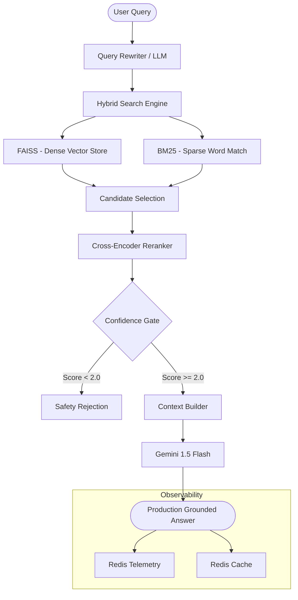

# ✈️ Aviation SOP RAG Platform

A production-hardened, high-precision Retrieval-Augmented Generation (RAG) system engineered for Aviation Standard Operating Procedures (SOPs). Built with professional standards for reliability, auditability, and observability.

---

## 🏗️ System Architecture

The platform follows a strictly modular, multi-stage pipeline designed to maximize recall and precision while ensuring production safety.



---

## 🚀 Professional Setup

This repository is engineered for a seamless developer experience using standard automation patterns.

### 1. Environment Configuration
Standardize your environment by creating a `.env` file from the provided template:
```bash
cp .env.example .env
# Open .env and add your GEMINI_API_KEY and VOYAGE_API_KEY
```

### 2. Knowledge Base Initialization
Cleanse and ingest the aviation knowledge base using the optimized pipeline:
```bash
make ingest
```

### 3. Deployment
Launch the full stack (API + Redis) using Docker Compose:
```bash
make docker-up
```

---

## 🛠️ Developer Interface (Makefile)

Standardize your workflow with the built-in `Makefile`:

- `make run`: Launch the development server with hot-reload.
- `make ingest`: Execute the full document ingestion and vectorization pipeline.
- `make docker-up`: Spin up the production-ready containerized stack.
- `make docker-down`: Gracefully shut down all services.
- `make logs`: Monitor real-time logs from the containerized API.

---

## 📈 Observability & Interview Gold

The platform features an enterprise-grade observability suite:
- **Health Checks**: `GET /health` for operational readiness.
- **Advanced Telemetry**: `GET /metrics` provides real-time Success Rates, Cache Hit Ratios, and rolling Window Latency.
- **Production Logging**: Structured logging respects `LOG_LEVEL` environment settings.

---

## 💎 System Design Rationale

- **Hybrid Retrieval**: Combines semantically rich dense embeddings with keyword-exact sparse matching (BM25) to satisfy strict aviation precision requirements.
- **Confidence Gating**: Implements a Rerank Confidence Gate (threshold: 2.0) to prevent hallsucinations and ensure the model only answers when high-quality evidence is found.
- **Cache Stampede Protection**: Uses explicit Redis locking to ensure efficient performance under high concurrent load.
- **Lifespan Initialization**: Preloads all heavy resources (FAISS indices, encoders) into memory during startup to eliminate cold-query latency.

---

### 🛡️ Maintenance Scripts
- `scripts/reset.sh`: Clears the local vector database for clean re-ingestions.
- `scripts/rebuild.sh`: Automatically runs ingestion and relaunches the entire Docker stack.

---

## 🧪 Evaluation Suite

The platform includes a dedicated discovery and evaluation framework to measure system accuracy and retrieval precision.

### Running Benchmarks
Execute the evaluation suite from the project root:
```bash
python evaluation/evaluate.py
```

### Captured Metrics
- **Accuracy**: Measures keyword presence in the generated answer against ground-truth SOP definitions.
- **Retrieval Hit Rate**: Quantifies the "Recall" performance by checking if the correct context chunks were present in the Top-3 results.
- **End-to-End Latency**: Tracks the full pipeline execution time (Rewrite -> Retrieve -> Rerank -> LLM).
- **Cache Hit Monitoring**: Reports whether the measurement was performed via a fresh LLM call or a cached result.
