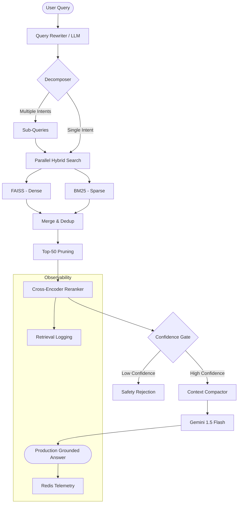

# ✈️ Aviation SOP RAG Platform

A production-hardened, high-precision Retrieval-Augmented Generation (RAG) system engineered for Aviation Standard Operating Procedures (SOPs). Built with professional standards for reliability, auditability, and observability.

---

## 🏗️ System Architecture

The platform follows a strictly modular, multi-stage pipeline designed to maximize recall and precision while ensuring production safety.



---

## 🚀 Professional Setup

This repository is engineered for a seamless developer experience using standard automation patterns.

### 1. Environment Configuration
Standardize your environment by creating a `.env` file from the provided template:
```bash
cp .env.example .env
# Open .env and add your GEMINI_API_KEY and VOYAGE_API_KEY
```

### 2. Knowledge Base Initialization
Cleanse and ingest the aviation knowledge base using the optimized pipeline:
```bash
make ingest
```

### 3. Deployment
Launch the full stack (API + Redis) using Docker Compose:
```bash
make docker-up
```

---

## 🛠️ Developer Interface (Makefile)

Standardize your workflow with the built-in `Makefile`:

- `make run`: Launch the development server with hot-reload.
- `make ingest`: Execute the full document ingestion and vectorization pipeline.
- `make docker-up`: Spin up the production-ready containerized stack.
- `make docker-down`: Gracefully shut down all services.
- `make logs`: Monitor real-time logs from the containerized API.

---

## 📈 Observability & Analytics

The platform features an enterprise-grade observability suite:
- **Health Checks**: `GET /health` for operational readiness.
- **Advanced Telemetry**: `GET /metrics` provides real-time Success Rates, Cache Hit Ratios, and rolling Window Latency.
- **Retrieval Logging**: Automatic telemetry for query intent and rerank scores to feed the Phase 3 feedback loop.
- **Production Logging**: Structured logging respects `LOG_LEVEL` environment settings.

---

## 💎 System Design Rationale

- **Heuristic-Gated Decomposition**: Detects complex, multi-intent queries and breaks them into targeted sub-queries for broader recall.
- **Parallel Hybrid Retrieval**: Executes FAISS (Semantic) and BM25 (Keyword) streams in parallel using thread pools and **backpressure-controlled semaphores** (max 4) to prevent resource exhaustion.
- **Fault-Tolerant Execution**: Implements strict **5.0s timeouts** and partial failure handling to ensure API availability even if individual retrieval components hang.
- **Recall-First Pruning**: Merges multi-query results and prunes to the Top-50 most relevant candidates based on **normalized hybrid scores**.
- **Tiered Confidence UX**: Implements a three-tier response system (Reject < 0.3, Warning 0.3-0.6, Confident > 0.6) to manage user expectations and safety.
- **Signal-Based Guardrails**: Fast, rule-based post-validation that checks for source attribution, uncertainty patterns (e.g., "I think"), and response quality before delivery.
- **Deep Feedback Pipeline**: Automatically logs failed or low-confidence interactions with full context into Redis.
- **Structured JSON Logging**: Environment-aware logging (JSON in prod) with integrated **Request IDs** for distributed tracing.
- **Startup Resilience**: Robust startup lifecycle with exponential backoff retries for Redis and graceful degradation.
- **Granular Cold Start Metrics**: Automatic timing of embedding, index, and engine loading during boot.
- **Ranking-Preserved Compaction**: Strict token-aware context building (max 3,000 tokens) that maintains rerank signal while preventing context overflow.

---

### 🛡️ Maintenance Scripts
- `scripts/reset.sh`: Clears the local vector database for clean re-ingestions.
- `scripts/rebuild.sh`: Automatically runs ingestion and relaunches the entire Docker stack.

---

## 🚀 Deployment

The system is fully containerized for production readiness.

### Prerequisites
- Docker & Docker Compose
- Environment file (`.env.dev` or `.env.prod`)

### Launching the Stack
Spin up the stack using the production environment:
```bash
cp .env.prod .env
docker-compose up -d --build
```

The API includes a production-hardened **Docker Health Check** and graceful shutdown handling.

---

## 🧪 Evaluation Suite

The platform includes a dedicated discovery and evaluation framework to measure system accuracy and retrieval precision.

### Running Benchmarks
Execute the evaluation suite from the project root:
```bash
python evaluation/evaluate.py
```

### Captured Metrics
- **Accuracy**: Measures keyword presence in the generated answer against ground-truth SOP definitions.
- **Faithfulness**: LLM-as-a-judge metric verifying if the answer is strictly grounded in the retrieved context.
- **Retrieval Hit Rate**: Quantifies the "Recall" performance by checking if the correct context chunks were present in the retrieval stage.
- **End-to-End Latency**: Tracks the full pipeline execution time (Rewrite -> Retrieve -> Rerank -> LLM).
