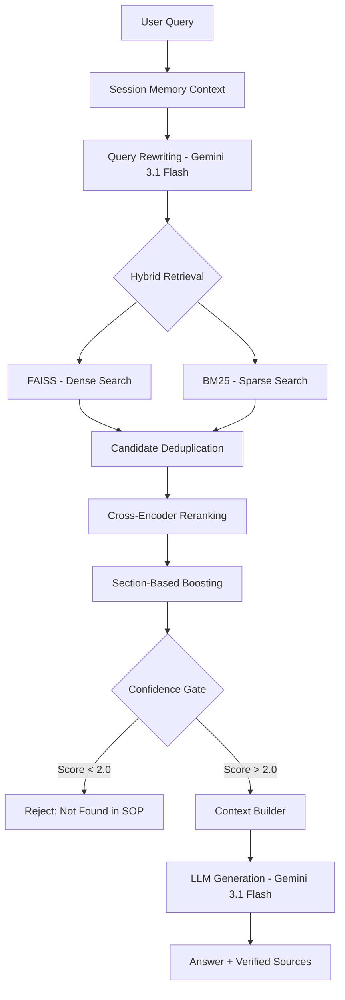

# ✈️ Aviation SOP Conversational RAG System

[](https://opensource.org/licenses/MIT)
[](https://www.python.org/downloads/)
[](https://fastapi.tiangolo.com/)

A production-grade, domain-specific conversational AI system built using **Retrieval-Augmented Generation (RAG)** for aviation Standard Operating Procedures (SOPs). This system delivers high-precision, grounded, and traceable answers by combining advanced retrieval strategies with deterministic safety gates.

---

## 🚀 Key Features

*   **Structured PDF Ingestion**: Section and subsection-aware parsing for granular context.
*   **Hybrid Retrieval Engine**: Dual-stream search combining **FAISS** (Semantic/Dense) and **BM25** (Keyword/Sparse) for 100% recall of technical acronyms (SOP, PM, etc.).
*   **Precision Reranking**: Integrated `CrossEncoder` rescoring with custom **Section-Based Boosting** to prioritize technical chapters over summaries.
*   **Safety Gate (Deterministic)**: Automated confidence thresholding to prevent hallucinations for out-of-scope queries.
*   **Production Caching**: Multi-layer Redis caching with **Distributed Locking** to prevent cache stampedes.
*   **Observability Dashboard**: Built-in `/metrics` endpoint for real-time tracking of latency, cache efficiency, and query volume.

---

## 🧠 Architecture



---

## 📁 Project Structure

```text
aviation-rag/
├── app/
│   ├── api/                # API Endpoints (FastAPI)
│   ├── models/             # Pydantic Schemas
│   ├── services/           # Core Logic (LLM, Retrieval, Reranking)
│   │   ├── metrics.py      # Observability & Monitoring
│   │   ├── hybrid.py       # FAISS + BM25 Orchestration
│   │   └── cache.py        # Redis Locking & Key Logic
│   ├── utils/              # Data Processing Pipelines
│   └── main.py             # App Entry Point
├── data/                   # Knowledge Base (Raw & Processed)
├── scripts/                # Data Ingestion & Benchmarking
└── requirements.txt        # Production Dependencies
```

---

## ⚙️ Setup Instructions

### 1. Prerequisites
- **Python 3.10+**
- **Redis Service** (Running on `localhost:6379`)

### 2. Installation
```bash
git clone https://github.com/zeeshan2423/aviation-rag.git
cd aviation-rag
pip install -r requirements.txt
```

### 3. Environment Variables
Create a `.env` file in the root directory:
```env
GOOGLE_API_KEY=your_gemini_api_key
VOYAGE_API_KEY=your_voyage_api_key
REDIS_HOST=localhost
REDIS_PORT=6379
HF_TOKEN=optional_for_faster_downloads
```

### 4. Data Ingestion
Populate the vector store and BM25 index:
```bash
python scripts/ingest.py
```

### 5. Launch Application
```bash
uvicorn app.main:app --port 8000
```

---

## 🧪 API Usage & Monitoring

### POST `/chat`
**Request:**
```json
{
  "query": "What are the responsibilities of Pilot Monitoring?",
  "session_id": "pilot_001"
}
```

**Response:**
```json
{
  "answer": "The PM is responsible for monitoring flight path, systems...",
  "sources": [
    { "section": "1. PURPOSE", "chunk_id": "sop_12" }
  ]
}
```

### GET `/metrics`
Exposes real-time production performance data:
- `total_queries`: Total requests served.
- `avg_latency_ms`: Rolling window average response time.
- `cache_hit_rate`: Success rate of the Redis caching layer.

---

## 🔐 Safety & Reliability

Our system implements a **Dual-Threshold Security Gate**:
*   **Threshold < 2.0**: The system returns a deterministic "Not found in SOP" to prevent hallucinations when the context is irrelevant.
*   **Threshold 2.0 - 5.0**: The response is provided but includes a precision warning: *"NOTE: This information may be incomplete."*
*   **Threshold > 5.0**: Full confidence response with direct source attribution.

---

## 📊 Example Benchmarks

| Query Type | System Behavior | Score Range |
| :--- | :--- | :--- |
| **Direct SOP Query** | ✅ Precise Answer | 6.0+ |
| **Vague/Acronym** | ✅ Hybrid Recall (PM/SOP) | 3.0 - 5.0 |
| **Out of Scope** | ❌ Deterministic Reject | < 1.0 |

---

> [!NOTE]
> This system is designed for **Pilot Training** and **Simulation Support**. Always refer to official FAA/Airline documentation for real-world flight operations.
