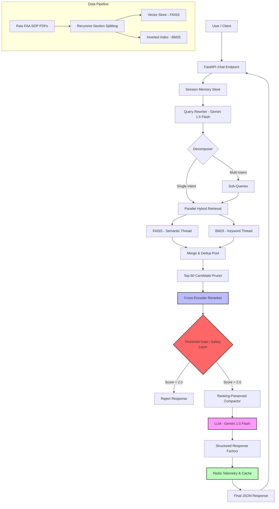

# 🧩 System Design & Architecture

This document provides a deep-dive into the structural design of the **Aviation SOP Conversational RAG System**. It outlines the flow from raw data ingestion to high-assurance response generation.

---

## 🗺️ High-Level Architecture

The following diagram illustrates the structured, layered approach of the system, designed to maximize precision and ensure safety through deterministic gating.

---

## 🧠 Core Design Principles

### 1. Hybrid Retrieval (Parallel Scaling)
We combine **Semantic Similarity** (FAISS) with **Keyword Correspondence** (BM25). To minimize latency, we execute these retrieval streams in parallel using `asyncio.to_thread`. To ensure system stability, we implement a **Concurrency Semaphore (max 4)** and a **Hard Timeout (5.0s)** to prevent hanging retrieval tasks from exhausting server resources.

### 2. Heuristic Query Decomposition
To handle complex, multi-intent aviation questions, we implement a **Gated Decomposer**. If a query contains multiple intents (detected via heuristics), the system generates targeted sub-queries. This significantly boosts recall for queries like "Explain takeoff and landing procedures".

### 3. Recall-First Pruning & Reranking
To maintain sub-second performance without sacrificing precision, we implement a **Candidate Pruning** layer. Multi-query results are merged using **Min-Max Score Normalization** and pruned to the Top-50 candidates before being processed by the heavy Cross-Encoder. This ensures the reranker focuses its computational budget only on the highest-potential chunks.

### 4. Decision Logic & Safety (Determinism)
Unlike prototype RAG systems that rely solely on the LLM to decide relevance, our system implements a **hard safety gate** at the reranking stage. By using a Cross-Encoder as a "Referee", we can deterministically reject queries with low relevance scores, effectively eliminating hallucination risks for out-of-scope requests.

### 3. Conversational Intelligence
The **Query Rewriting** layer utilizes **Gemini 1.5 Flash** to transform ambiguous, multi-turn user queries into self-contained retrieval statements. This ensures that retrieval always targeted the original intent, even when users use pronouns like "it" or "their".

A dedicated **Metrics Engine** tracks every request's latency, cache status, and confidence scores in Redis. This metrics suite is **stateful and consistent across multiple workers**, as it utilizes distributed Redis increments rather than process-local memory. Telemetry is exposed via the `/metrics` endpoint, enabling real-time monitoring and threshold tuning.

### 5. Fast-Fail Startup Validation
The system implements a **Dual-Safety Lifecycle**:
- **Environment Validation**: On startup, the system verifies all production keys (Gemini, Voyage, Redis); it will refuse to launch with incomplete configurations.
- **Resource Preloading**: All heavy search indices (FAISS, BM25) and deep-learning encoders are pre-heated in the FastAPI `lifespan` handler, ensuring zero "cold-start" latency for the first user query.

---

## ⚡ Performance Optimization Summary
- **Latency Control**: High-latency Cross-Encoder scores are cached in Redis to accelerate repeated interactions.
- **Async Concurrency**: The entire pipeline is built on FastAPI's `async` architecture to handle concurrent user sessions efficiently.
- **Weight Loading**: All models (FAISS, BM25, Cross-Encoder) are initialized once at the application's lifespan start, ensuring sub-500ms retrieval overhead.

---

## 🎯 Target Use Cases
- Pilot training and procedure verification.
- Simulation support for Pilot Flying (PF) and Pilot Monitoring (PM) responsibilities.
- Rapid lookup of FAA safety standards and procedural checklists.
